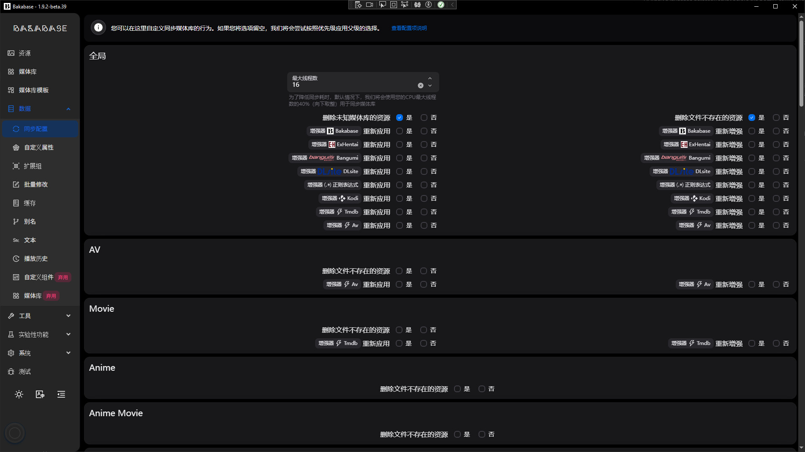
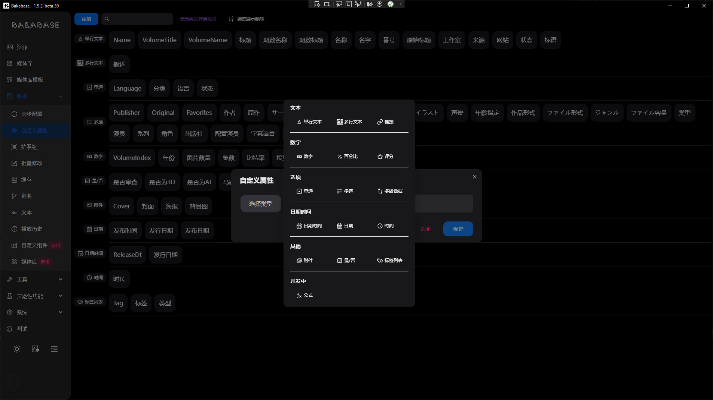
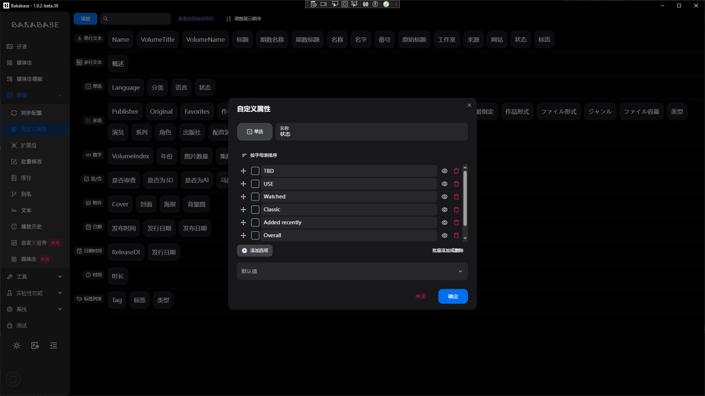
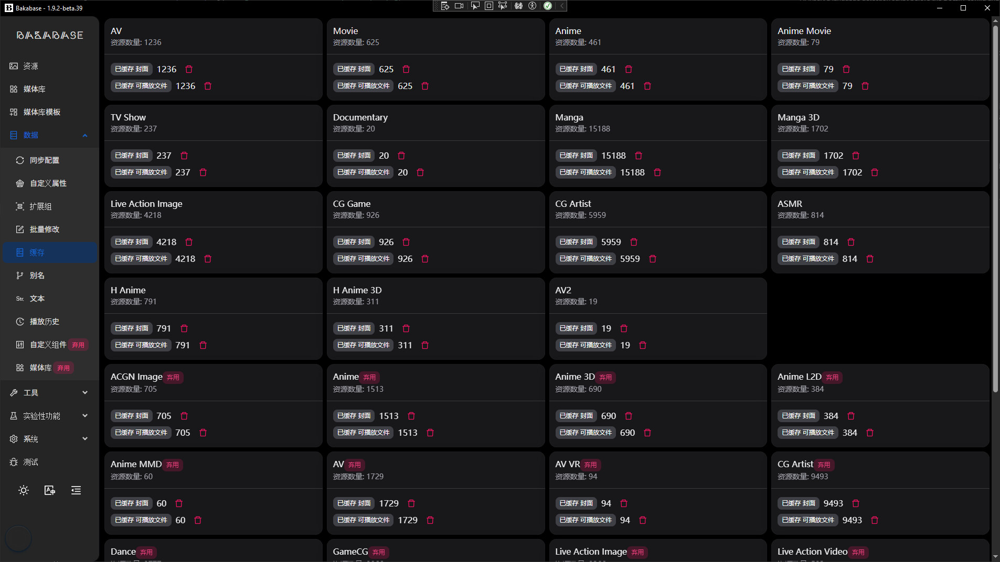
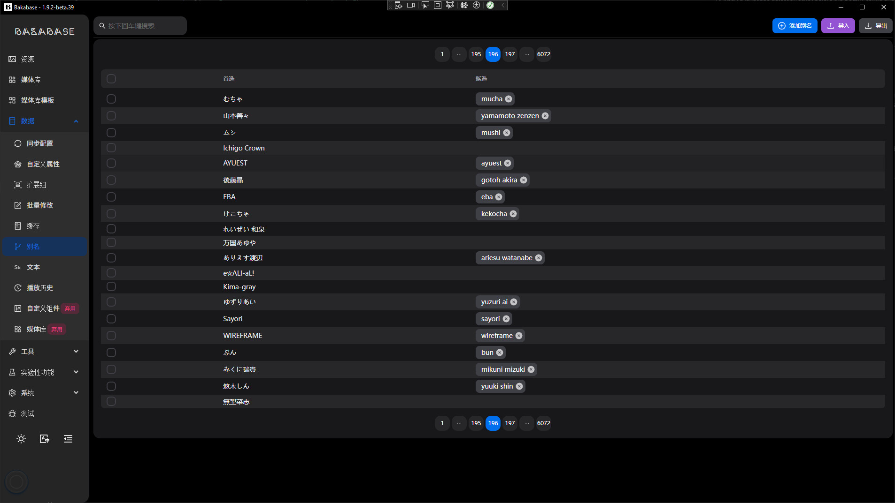
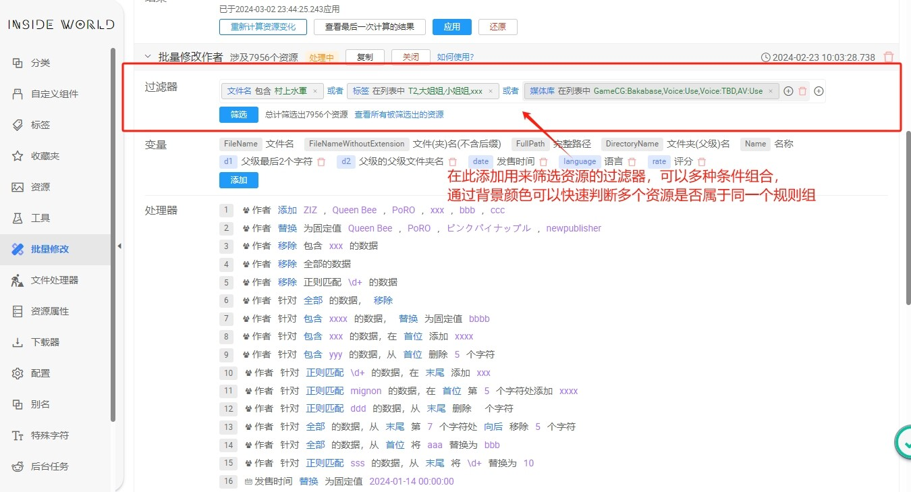
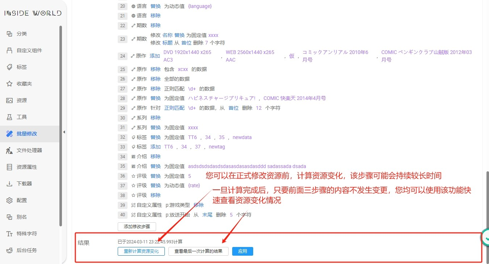

# 数据

## 同步选项
配置数据与文件的同步策略，控制扫描与更新行为。

## 自定义属性
为资源定义自定义字段，灵活扩展元数据结构。

## 文件扩展名组
预定义扩展名分组，用于在各种组件筛选文件

## 缓存
查看与管理系统缓存。

## 别名
为常用字段或标签配置别名，提升录入与检索效率。

## 批量修改（截图已过期，请以程序内为准）
以下截图文件名包含“outdated”，界面可能与当前版本不一致，仅供参考：

