# 工具

## 文件处理器
用于预览、解压、整理、重命名与移动下载后的文件。

提示：以下文件处理器相关截图文件名包含“outdated”，界面可能与当前版本不一致，请以程序内为准。

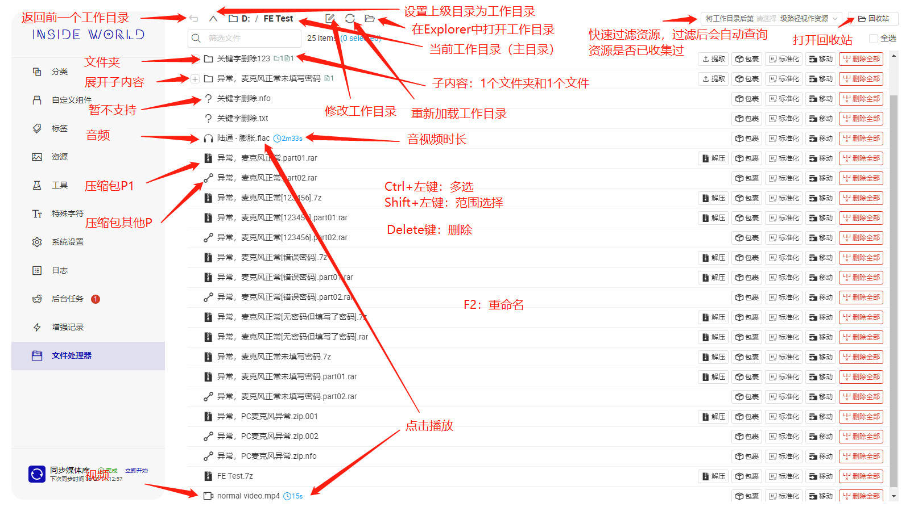
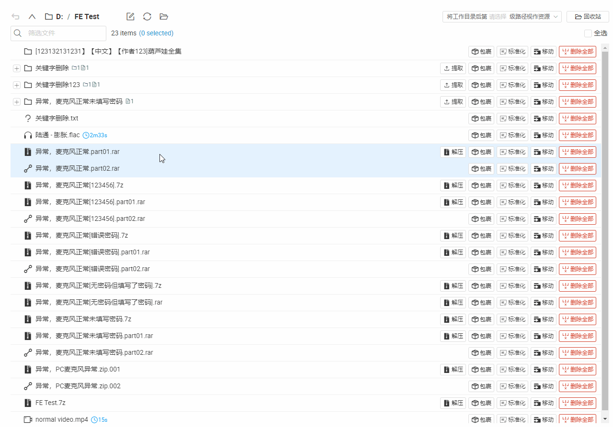

### 预览
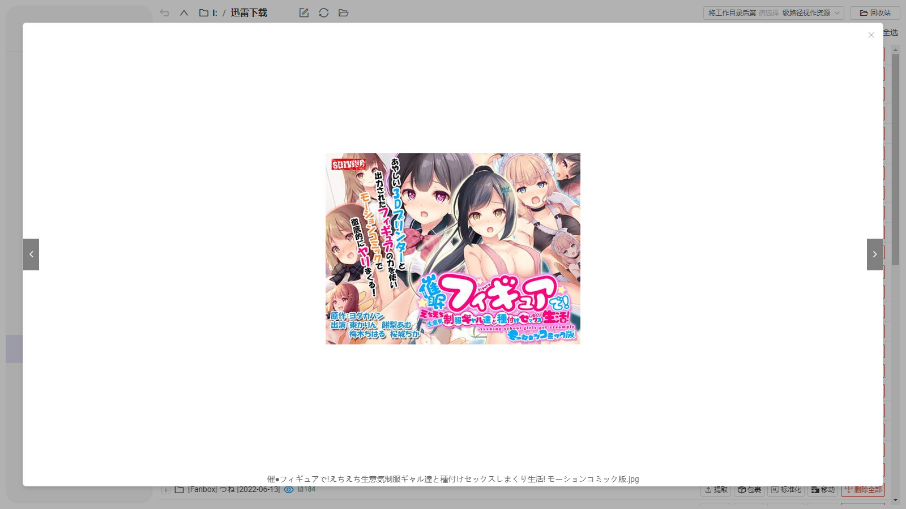
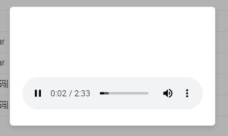
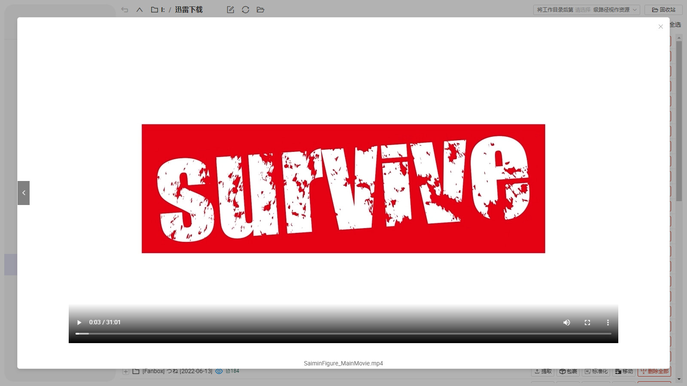

### 解压
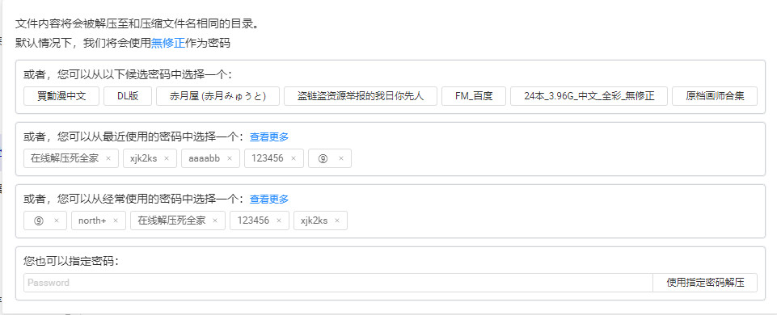
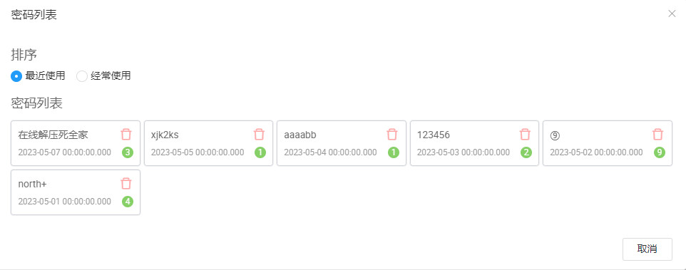
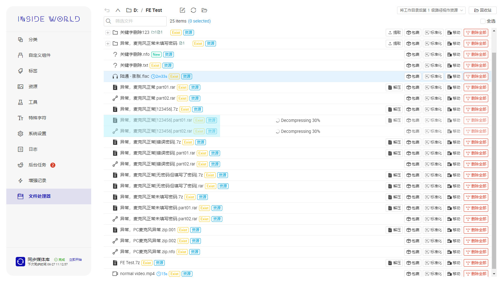

### 提取/合并/移动
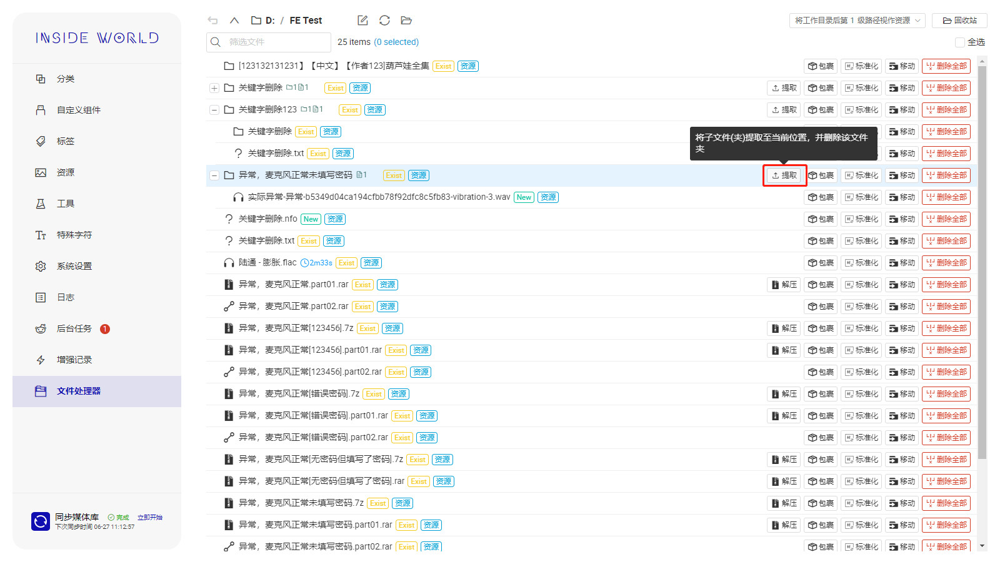

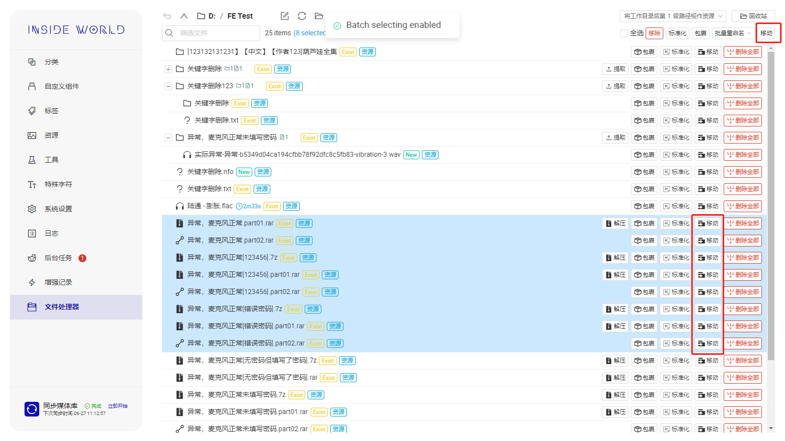
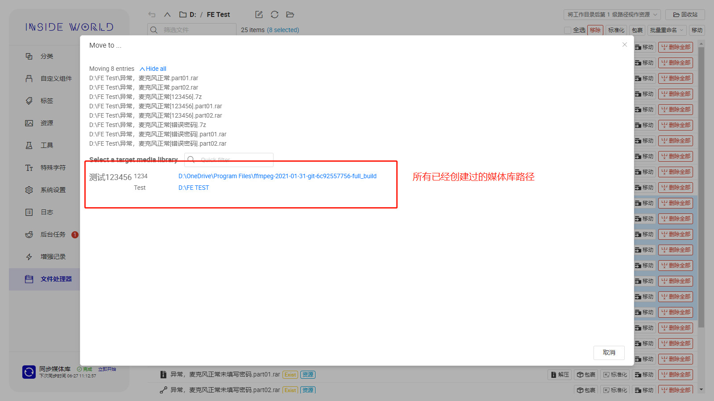

### 其他
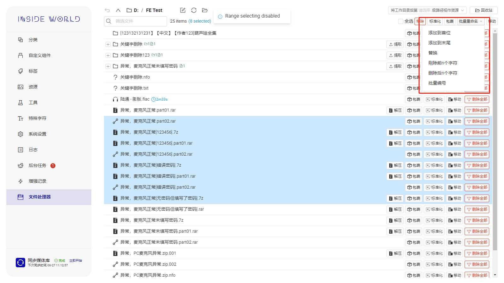
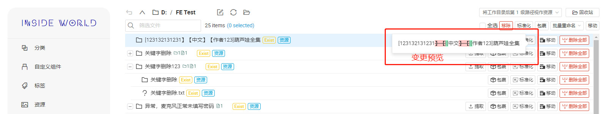
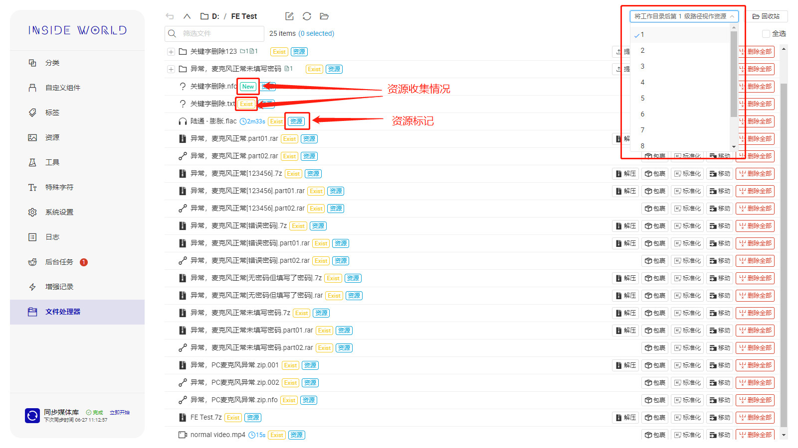

## 下载器
跨站点资源抓取与下载。

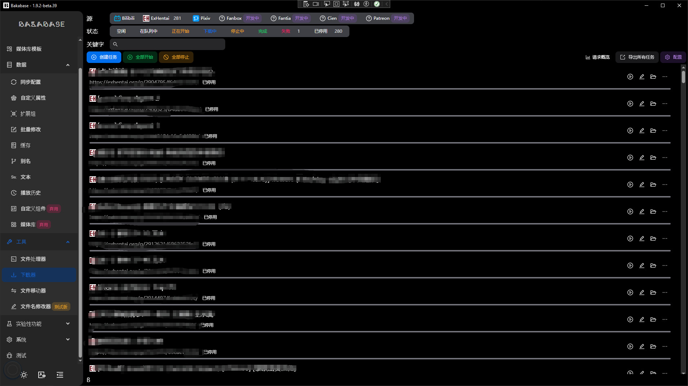
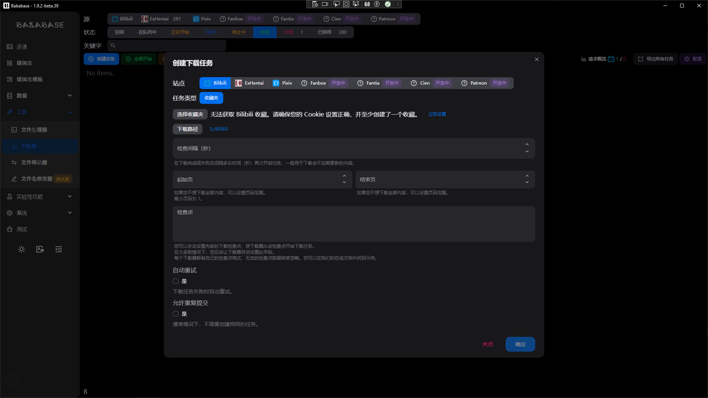
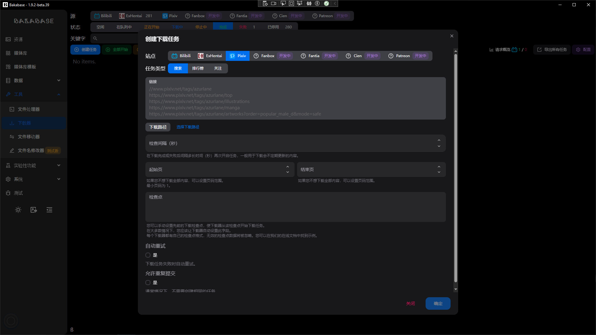
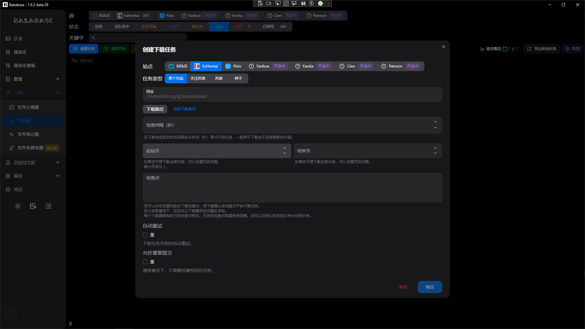

## 文件移动器
批量将文件从源目录移动到目标目录。

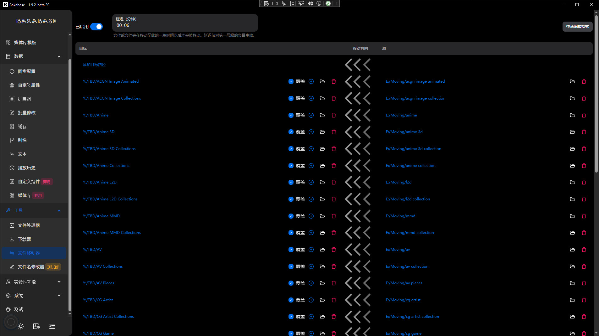

## 文件名修改器
按规则批量修改文件名。

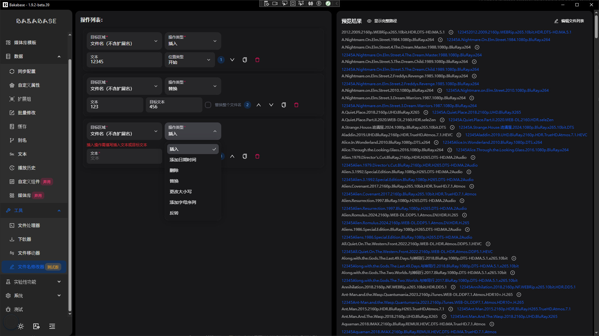