# Data

## Synchronization options
Configure how data and files are scanned and kept in sync.

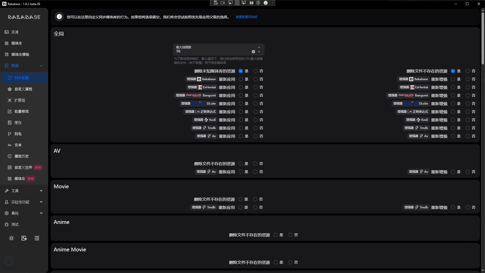

## Custom property
Define custom fields to extend resource metadata.

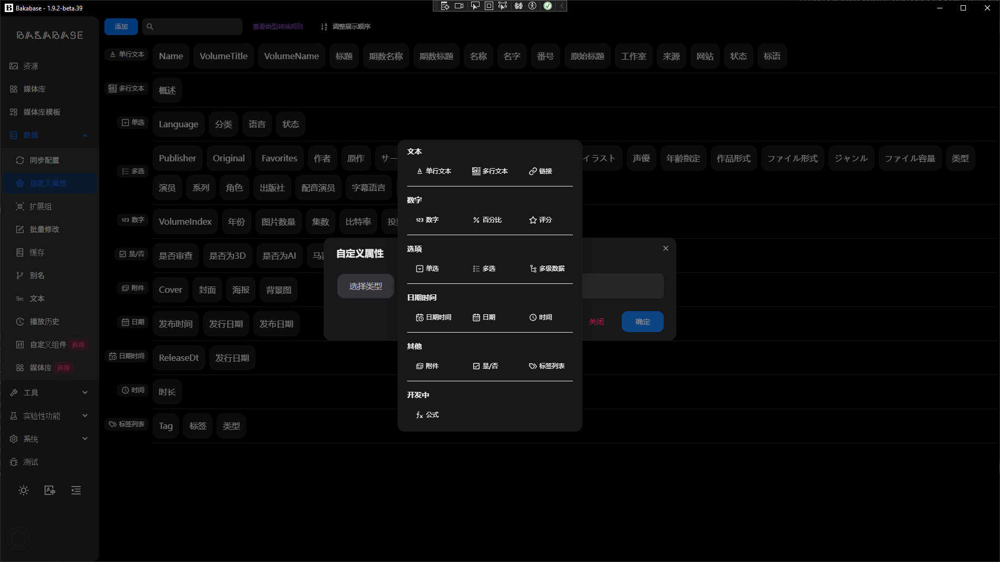
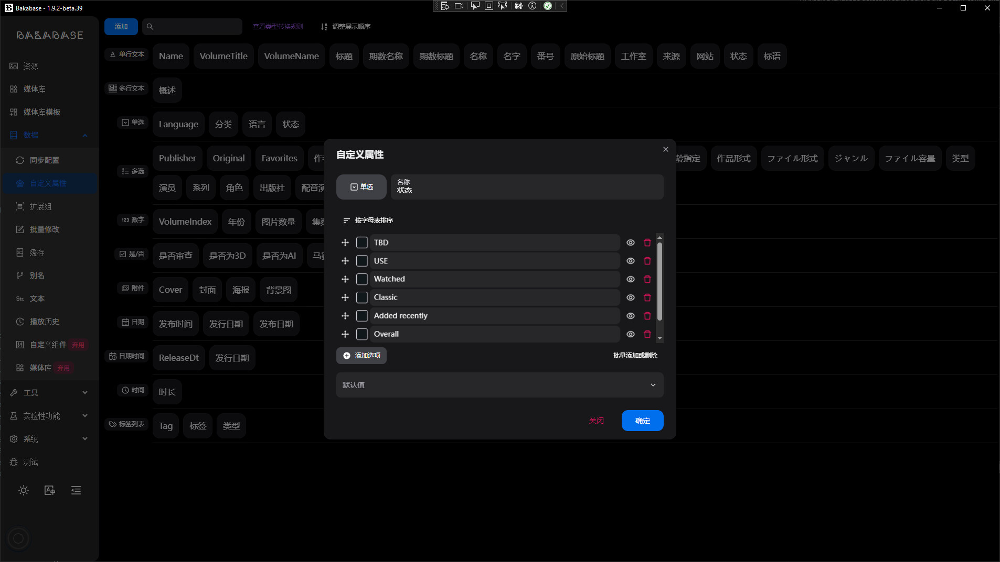
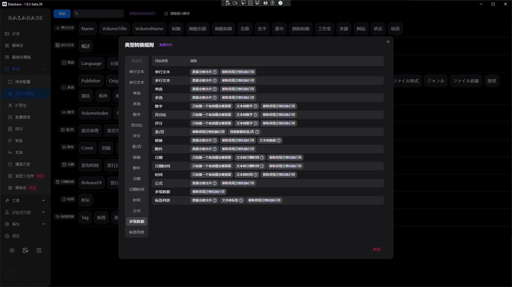

## File Extensions group
You can predefine some file extensions group to filter files in other features.

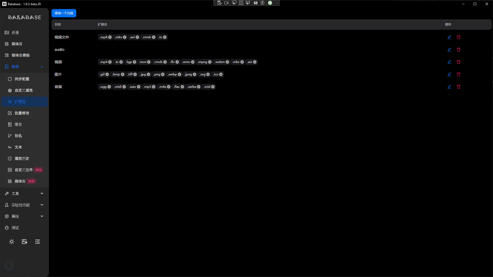

## Cache
Inspect and manage caches.

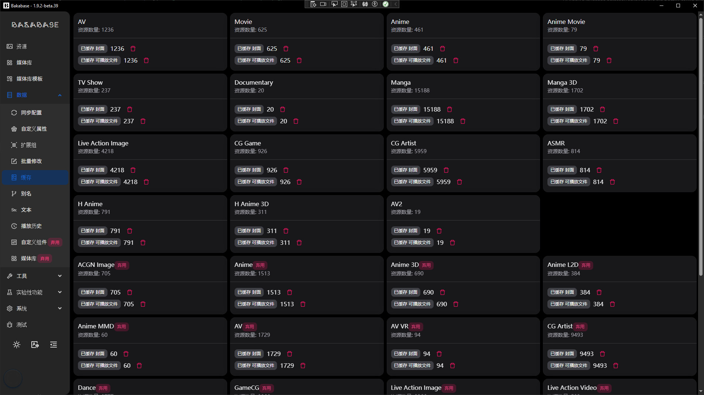

## Alias
Add aliases for common fields or tags to speed up input and search.

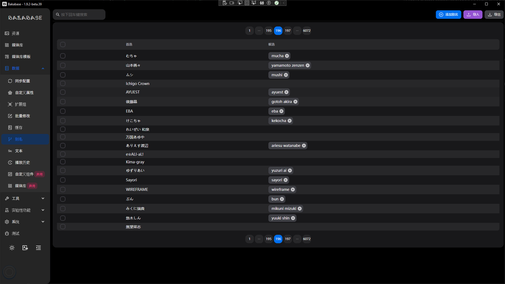

## Bulk modification (screenshots outdated, refer to in-app UI)
The following screenshots contain “outdated” in filenames and may differ from the current UI, for reference only:

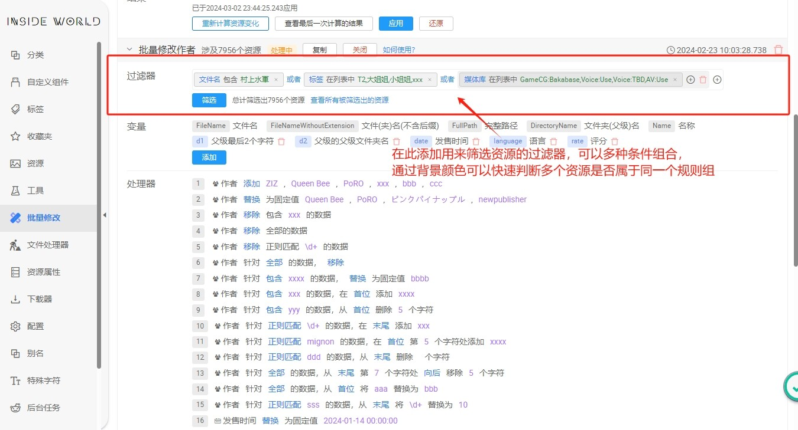
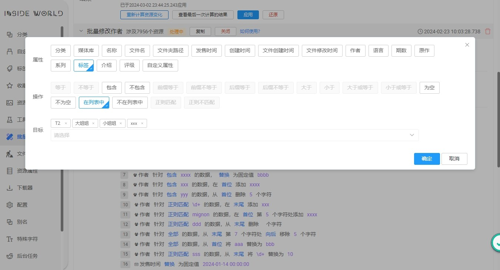
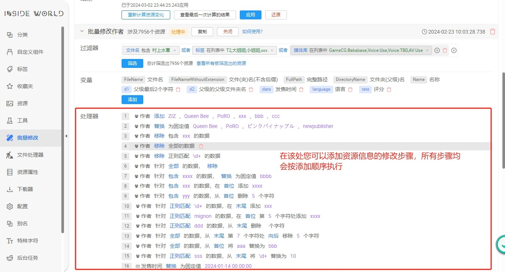
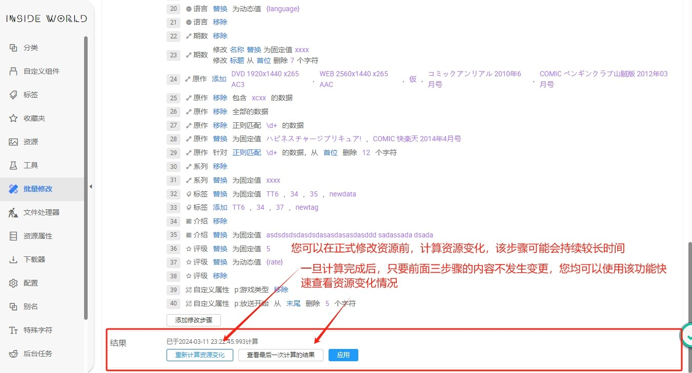
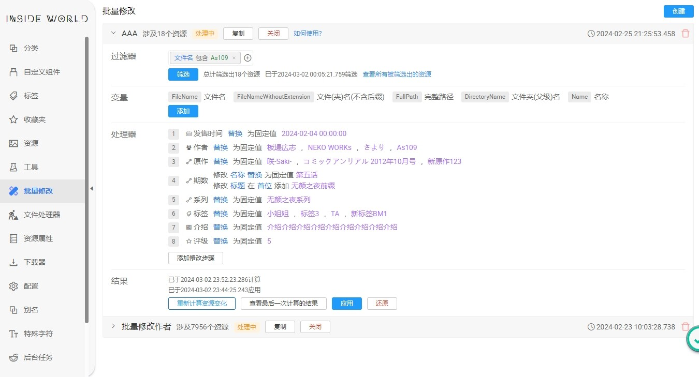
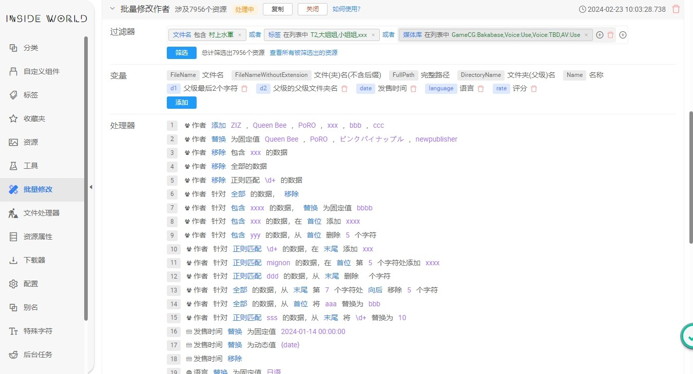
