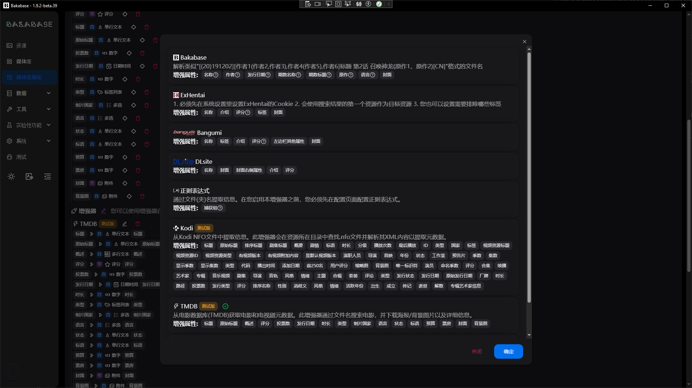

# Enhancer

## List
Manage sources and rules that enrich resource metadata (author, publish time, cover, tags, etc.).

## Detail
Configure match rules, request parameters, and priorities to avoid conflicts and improve accuracy.

### Priority and merge
When multiple enhancers provide the same field, use priority to control overrides; tags are usually merged.

### Enhancement records
Inspect recent enhancement tasks and logs for troubleshooting.

