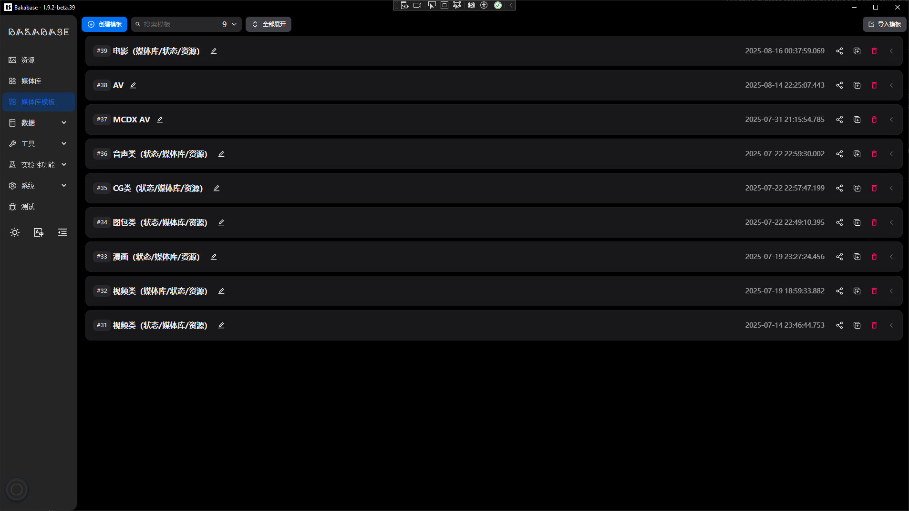
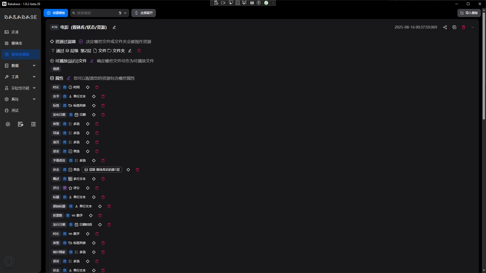
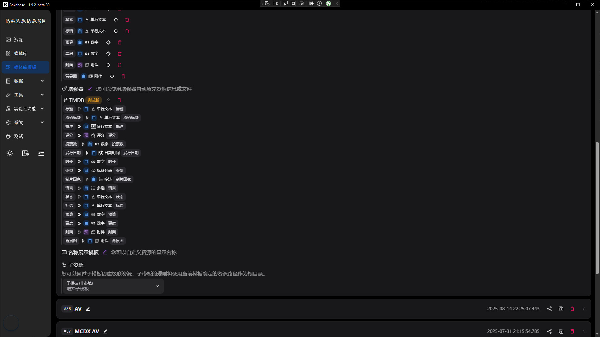
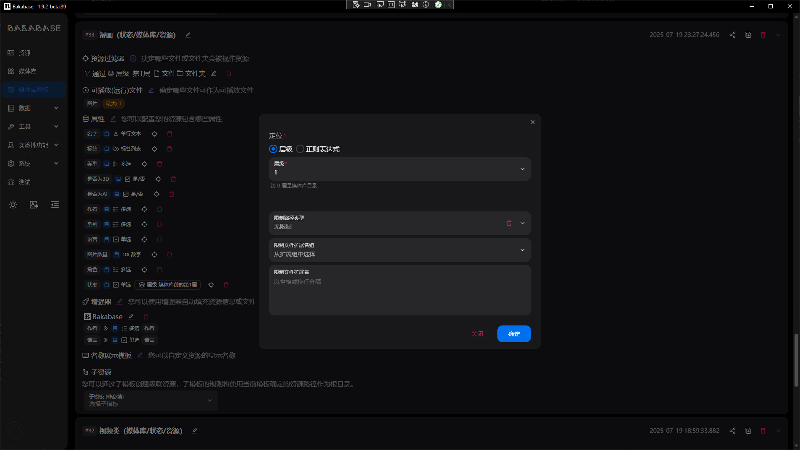
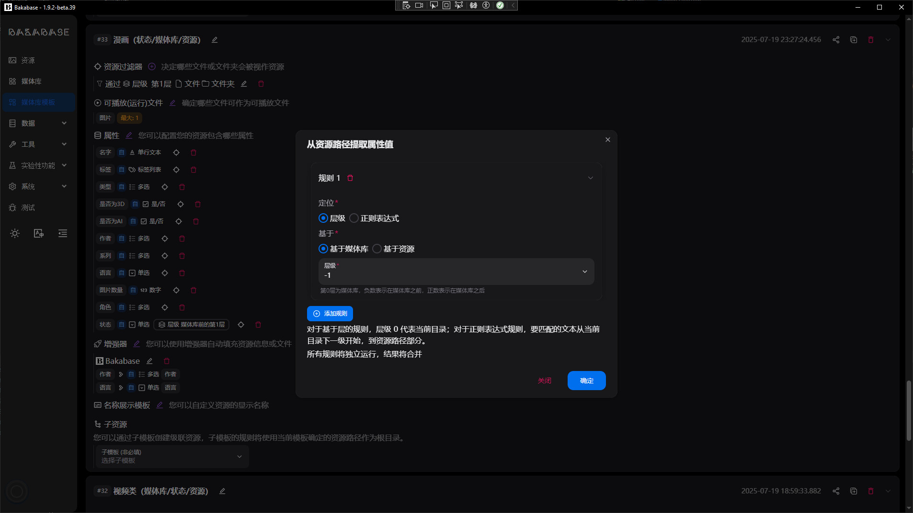
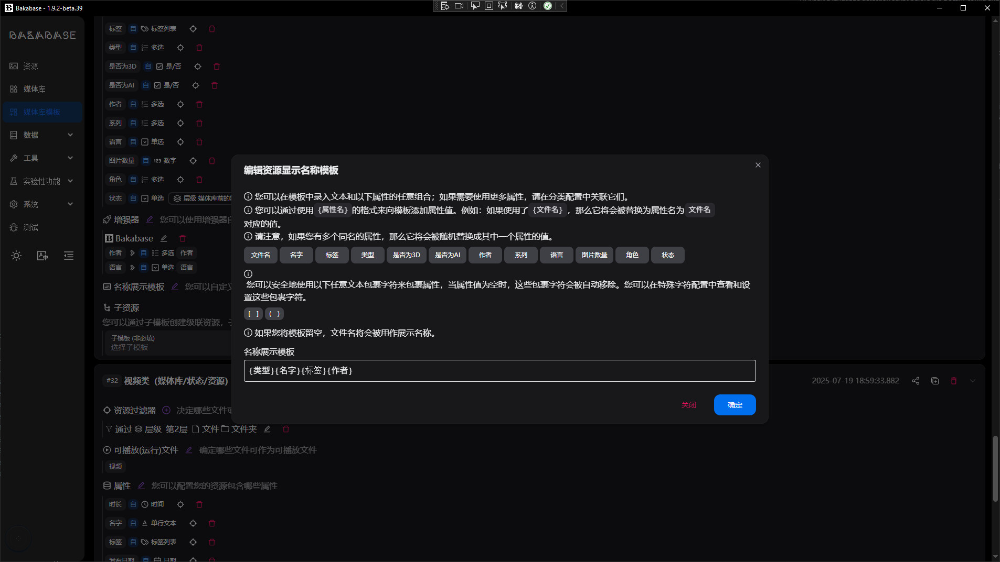

# Template

## List
Manage templates to define presentation and behavior in different contexts.

## Detail
Configure fields, locators, and display rules.

### Resource locator
Locate resources within a library.

### Property locator
Extract properties from files or paths.

### Resource display name
Generate user-friendly display names for resources.

